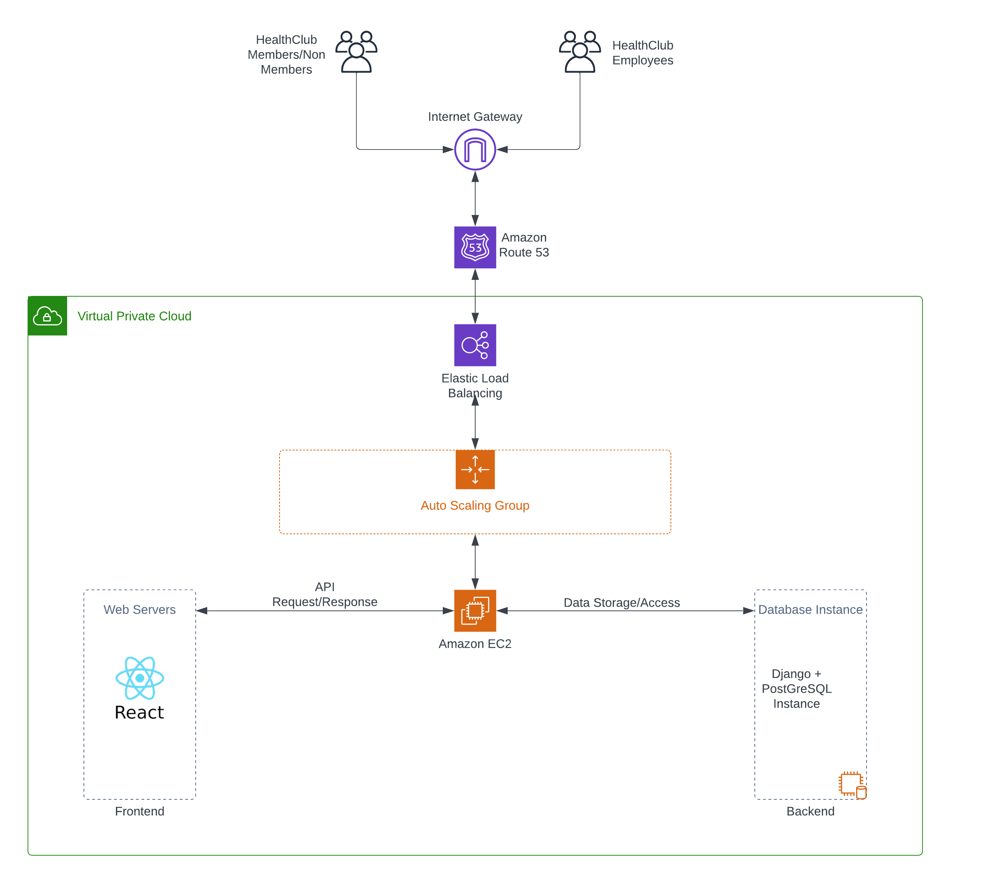

# HealthClub Membership Management System By Team - Code Wizards

### Team Members  
Bhavya Hegde - 016656029 
Blessy Dickson Daniel Moses -016697460 
Darshini Venkatesha Murthy Nag -016668951 
Sirisha Polisetty -016012477 

### Application URL
https://healthworks.space 

### Problem Statement
To Implement an end to end HealthClub Membership Management system for your favorite Health club/Gym.

### Application Features Based on Roles
#### Healthclub Employee Features
* Signup members and non-members to the app
* Enroll non-members in the training sessions
* Checkin and checkout members and non-members
* Manage membership(Eg. Upgrade non-members to members)
* Add new trainings
* View Analytics dashboard showing user activity summarized by location
  * Classes and enrollments by day/week/month
  * Hours spent in the gym by day/week/month
  * Number of visitors by the hour each day/weekday/weekend
  * Equipment usage statistics

#### Member Features
* Access the gym home page to see information about the gym, available membership plans,and class schedules for the selected location.
* Access a personalized page displaying individual class schedules and membership details
* Review past activities, including classes attended and workout sessions, with filters for the past week, month, or last 90 days
* Browse and sign up for classes based on the gym's class schedule and availability for the chosen location
* Record workout hours for various gym activities such as treadmill, cycling, stair machines, or weight training to track progress and achievements

#### Non-Member Features
* Non-members can view the homepage. 
* Non-members can view membership details and classes schedules based on locations.

### Architecture Diagram

### Tech Stack
* Frontend : ReactJS,Bootstrap
* Backend: Python Django REST Framework
* Database:PostgreSQL
* Tools used:Visual Studio code/Any IDE
* AWS components: EC2,Route 53,RDS, Application Load balancer and Auto-Scaling
### Sprint Meeting - Every Friday

### XP Core Values Implemented
* Communication - Everyone shared their ideas regarding the different potential situations outlined in the problem statement and expressed their viewpoints on which strategy could be the most effective.   
* Feedback - After evaluating the advantages and disadvantages, we provided feedback on each person's approach and decided to focus on the ones that appeared more promising.  

### Work Distribution
Bhavya Hegde - Frontend and Backend  
Blessy Dickson Daniel Moses - Frontend and Backend  
Darshini Venkatesha Murthy Nag - Frontend and Backend  
Sirisha Polisetty - Frontend and Backend  

### Design Decisions
* Our aim was to choose a UI design that is straightforward and basic in order to emphasize the functionality.
* We opted to use Django as our backend technology because it is a web framework based on Python that allowed us to build websites that rely on databases, and also offers strong assistance for developing REST APIs.
* The Django REST framework (DRF) is a versatile and has robust set of tools for constructing Web APIs, and its primary advantage is that it simplifies the serialization process.
* We opted to use ReactJs as our frontend technology as ReactJS boasts a modular architecture that facilitates easy development, management, updating, and scaling of applications. It's well-defined structure also simplifies testing and debugging. Additionally, UI components can be deconstructed and reused.
* We hosted our Application on Cloud using AWS as Cloud Provider.
* We Deployed our Application on Amazon EC2 as it offers a highly reliable environment.
* We used Application Load Balancer, to distribute Web traffic among EC2 instances.
* We hosted our Database on Amazon RDS. We chose PostGreSQL because we wanted to enforce the relationships between entities and as most of the data was structured.

### [UI Wireframes](https://github.com/gopinathsjsu/team-project-code-wizards/tree/main/UI%20Wireframework)

### [UML Diagrams](https://github.com/gopinathsjsu/team-project-code-wizards/tree/main/Diagrams)

### [API Documentation](https://docs.google.com/document/d/1L-xuCkBWL0NLYotEjAiYUzciYYHsNrZPEX1D7LG0Pvs/)

### [Project Board](https://github.com/orgs/gopinathsjsu/projects/75)

### [Project Journal](https://docs.google.com/spreadsheets/d/1Bi0zrF7mX-q2RkM4P8W8K3kymJNO0gGT/)

### [Project Sprint Task Sheet and Burndown Chart](https://docs.google.com/spreadsheets/d/1gh1m1cc37O5jzcjil8OEjS9EB_Ar_FAh/)

